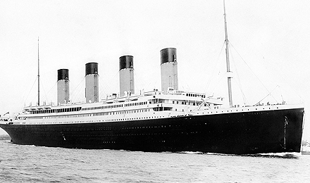
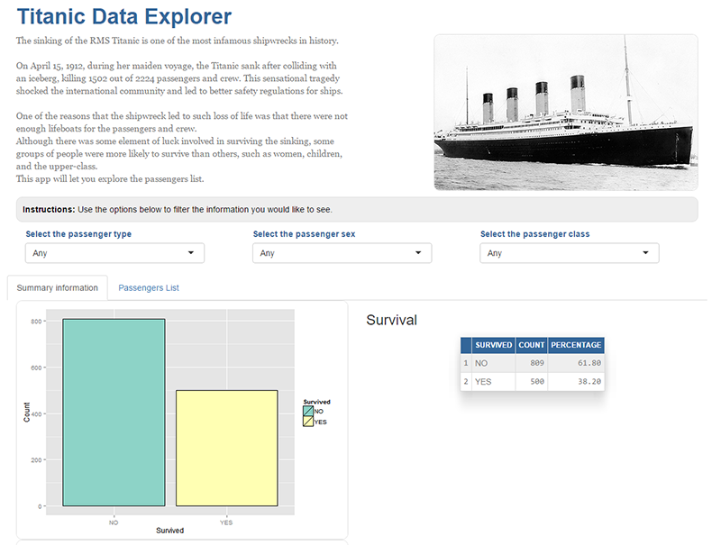

Titanic Data Explorer
========================================================

<small>Created for the Developing Data Products class on the Data Science Specialization from the Johns Hopkins University</small>

The Titanic Data Explorer
========================================================

- Have you ever wondered how many female and male passengers died when the Titanic sank?
- Have you ever wondered how many survived?
- How many people in Third Class died?

The Titanic Data Explorer was created to explore the Titanic passengers dataset.

Now, you can explore the Titanic passengers dataset right in your browser!


About the Titanic
========================================================

The sinking of the RMS Titanic is one of the most infamous shipwrecks in history. On April 15, 1912, during her maiden voyage, the Titanic sank after colliding with an iceberg, killing 1502 out of 2224 passengers and crew. This sensational tragedy shocked the international community and led to better safety regulations for ships.

One of the reasons that the shipwreck led to such loss of life was that there were not enough lifeboats for the passengers and crew.
Although there was some element of luck involved in surviving the sinking, some groups of people were more likely to survive than others, such as women, children, and the upper-class.


Sample of the App
========================================================
Here's a sample screenshot of the app.




Summary of the dataset used
========================================================
Here's a summary of the data you'll be able to explore in the Titanic Data Explorer.


```r
summary(titanic)
```

```
       X                                 Passenger.Name Passenger.Sex
 Min.   :   1   Connolly, Miss. Kate            :   2   Female:466   
 1st Qu.: 328   Kelly, Mr. James                :   2   Male  :843   
 Median : 655   Abbing, Mr. Anthony             :   1                
 Mean   : 655   Abbott, Master. Eugene Joseph   :   1                
 3rd Qu.: 982   Abbott, Mr. Rossmore Edward     :   1                
 Max.   :1309   Abbott, Mrs. Stanton (Rosa Hunt):   1                
                (Other)                         :1301                
 Passsenger.Age  Passenger.Survived  Passenger.Class
 Min.   : 0.00   NO :809            1st Class:323   
 1st Qu.:21.00   YES:500            2nd Class:277   
 Median :28.00                      3rd Class:709   
 Mean   :29.86                                      
 3rd Qu.:39.00                                      
 Max.   :80.00                                      
 NA's   :263                                        
```

